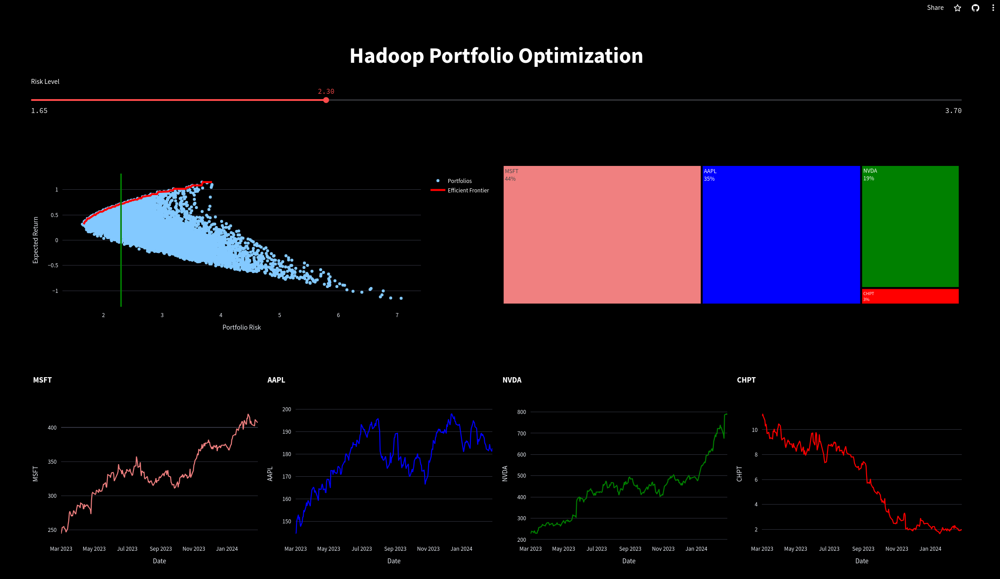

# Dashboard for Hadoop Map Reduce Portfolio Optimization Project

This repository contains the code for a supplemntary dashboard for the Hadoop Map Reduce Portfolio Optimization Project.

The main project repository can be accessed through the following link:
- https://github.com/juan-esteban-berger/Hadoop_Portfolio_Optimization

This project demonstrates a simple implmentation of Markowitz's Modern Portfolio Theory using Hadoop Map Reduce to perform Mean-Variance Optimization on the following stocks:
- Microsoft (MSFT)
- Apple (AAPL)
- NVDA (NVIDIA)
- ChargePoint Holdings (CHPT)

The results of this portfolio optimization were visualized in this interactive dashboard:
- https://hadoop-portfolio.streamlit.app/

